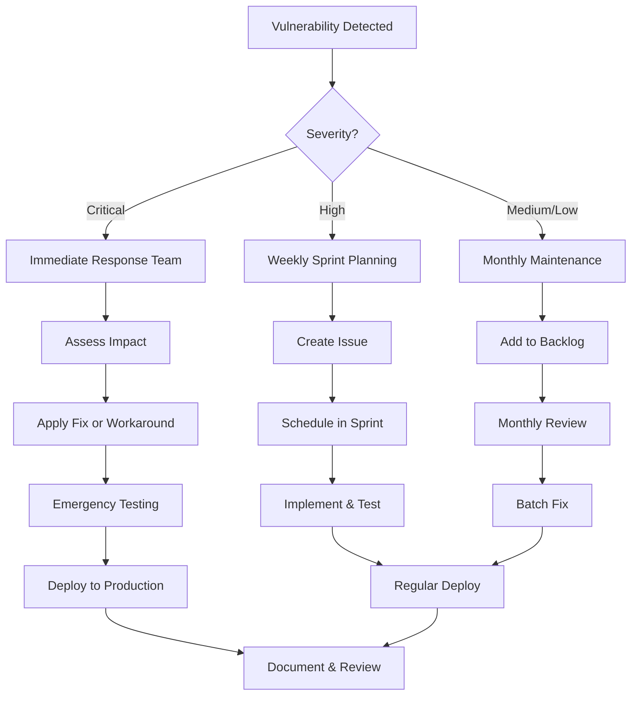

# Long-Term Security Prevention Guide
## AIRA Publishing Hydrogen Project

**Last Updated:** January 21, 2026
**Status:** Active
**Owner:** Development Team

---

## Table of Contents

1. [Executive Summary](#executive-summary)
2. [Automated Dependency Scanning](#automated-dependency-scanning)
3. [GitHub Security Features](#github-security-features)
4. [npm Audit in CI/CD](#npm-audit-in-cicd)
5. [Regular Maintenance Schedule](#regular-maintenance-schedule)
6. [Security Tools & Integrations](#security-tools--integrations)
7. [Vulnerability Response Workflow](#vulnerability-response-workflow)
8. [npm Overrides Strategy](#npm-overrides-strategy)
9. [Developer Best Practices](#developer-best-practices)
10. [Security Monitoring Checklist](#security-monitoring-checklist)

---

## Executive Summary

This guide establishes processes and tools for **proactive security management** of npm dependencies in the AIRA Publishing Hydrogen project. The goal is to identify and remediate vulnerabilities before they become exploitable in production.

**Key Principles:**
- **Automation First**: Minimize manual security checks through automation
- **Fail Fast**: Catch vulnerabilities in CI/CD before they reach production
- **Regular Cadence**: Scheduled reviews prevent security debt accumulation
- **Documentation**: Track decisions and rationale for future reference

---

## 1. Automated Dependency Scanning

### 1.1 GitHub Dependabot

**What it does:** Automatically creates pull requests when vulnerable dependencies are detected.

#### Setup Instructions

1. **Enable Dependabot** (if not already enabled):
   ```yaml
   # Create .github/dependabot.yml
   version: 2
   updates:
     - package-ecosystem: "npm"
       directory: "/"
       schedule:
         interval: "weekly"
         day: "monday"
         time: "09:00"
       open-pull-requests-limit: 10

       # Group patch updates together
       groups:
         patch-updates:
           update-types:
             - "patch"

       # Security updates always get their own PR
       security-updates:
         enabled: true

       # Auto-merge minor and patch updates (optional)
       allow:
         - dependency-type: "direct"
           update-types: ["minor", "patch"]
         - dependency-type: "indirect"
           update-types: ["patch"]

       # Ignore specific packages if needed
       ignore:
         - dependency-name: "@shopify/hydrogen"
           update-types: ["version-update:semver-major"]
   ```

2. **Configure Dependabot Security Updates**:
   - Go to: Settings → Security & analysis → Dependabot security updates
   - Enable: ✅ Dependabot security updates
   - Enable: ✅ Grouped security updates

3. **Set up Auto-merge for Low-Risk Updates** (optional):
   ```yaml
   # .github/workflows/dependabot-auto-merge.yml
   name: Dependabot Auto-merge
   on: pull_request

   permissions:
     contents: write
     pull-requests: write

   jobs:
     dependabot:
       runs-on: ubuntu-latest
       if: github.actor == 'dependabot[bot]'
       steps:
         - name: Dependabot metadata
           id: metadata
           uses: dependabot/fetch-metadata@v1

         - name: Auto-merge patch updates
           if: steps.metadata.outputs.update-type == 'version-update:semver-patch'
           run: gh pr merge --auto --squash "$PR_URL"
           env:
             PR_URL: ${{github.event.pull_request.html_url}}
             GITHUB_TOKEN: ${{secrets.GITHUB_TOKEN}}
   ```

#### Benefits
- 🔄 **Automatic PRs** for security updates
- 📊 **Visual dashboard** of vulnerable dependencies
- 🎯 **Zero configuration** after initial setup
- 🆓 **Free** for public and private repositories

---

### 1.2 Snyk Integration

**What it does:** Advanced vulnerability scanning with deeper analysis and fix recommendations.

#### Setup Instructions

1. **Install Snyk CLI**:
   ```bash
   npm install -g snyk
   ```

2. **Authenticate**:
   ```bash
   snyk auth
   ```

3. **Scan Project**:
   ```bash
   # Test for vulnerabilities
   snyk test

   # Monitor project (sends results to Snyk dashboard)
   snyk monitor
   ```

4. **Add Snyk to GitHub Actions**:
   ```yaml
   # .github/workflows/security-scan.yml
   name: Security Scan
   on:
     push:
       branches: [main]
     pull_request:
       branches: [main]
     schedule:
       - cron: '0 0 * * 0'  # Weekly on Sunday

   jobs:
     security:
       runs-on: ubuntu-latest
       steps:
         - uses: actions/checkout@v4

         - name: Setup Node.js
           uses: actions/setup-node@v4
           with:
             node-version: '18'

         - name: Install dependencies
           run: npm ci

         - name: Run Snyk Security Scan
           uses: snyk/actions/node@master
           env:
             SNYK_TOKEN: ${{ secrets.SNYK_TOKEN }}
           with:
             args: --severity-threshold=high

         - name: Upload result to GitHub Code Scanning
           uses: github/codeql-action/upload-sarif@v2
           with:
             sarif_file: snyk.sarif
   ```

5. **Configure Snyk Policy** (`.snyk` file):
   ```yaml
   # .snyk
   version: v1.22.0

   # Ignore specific vulnerabilities (with expiration)
   ignore:
     'SNYK-JS-SOMEPKG-12345':
       - '*':
           reason: 'Not exploitable in our use case'
           expires: '2026-03-21T00:00:00.000Z'

   # Patch specific vulnerabilities
   patch: {}
   ```

#### Benefits
- 🔍 **Deep analysis** with fix priority scoring
- 🛠️ **Automated fixes** via `snyk wizard`
- 📈 **Trend analysis** and security debt tracking
- 🎯 **License compliance** checking

---

### 1.3 Alternative: Socket Security

**What it does:** Detects malicious packages and supply chain attacks before they enter your codebase.

#### Setup Instructions

```bash
# Install Socket CLI
npm install -g @socketsecurity/cli

# Initialize
socket login

# Scan package-lock.json
socket report create --project-name="aira-publishing-hydrogen"
```

#### GitHub App Integration
1. Install Socket GitHub app from: https://socket.dev/integrations/github
2. Configure to monitor `package.json` and `package-lock.json` changes
3. Socket will comment on PRs with security findings

#### Benefits
- 🚨 **Supply chain attack detection**
- 🔐 **Typosquatting protection**
- ⚡ **Real-time alerts** on malicious packages
- 🎯 **Pre-installation warnings**

---

## 2. GitHub Security Features

### 2.1 Security Advisories

**Enable Private Vulnerability Reporting**:
1. Go to: Settings → Security → Private vulnerability reporting
2. Enable: ✅ Allow users to privately report security vulnerabilities

**Create Security Policy**:
```markdown
# .github/SECURITY.md
# Security Policy

## Supported Versions

| Version | Supported          |
| ------- | ------------------ |
| 2025.x  | :white_check_mark: |
| < 2025  | :x:                |

## Reporting a Vulnerability

Please report security vulnerabilities via GitHub's Private Vulnerability Reporting:
https://github.com/[your-org]/aira-publishing-hydrogen/security/advisories/new

Expected response time: 48 hours
```

### 2.2 Code Scanning (GitHub Advanced Security)

**For GitHub Enterprise or Public Repos**:

```yaml
# .github/workflows/codeql.yml
name: CodeQL Analysis
on:
  push:
    branches: [main]
  pull_request:
    branches: [main]
  schedule:
    - cron: '0 12 * * 1'  # Monday at noon

jobs:
  analyze:
    runs-on: ubuntu-latest
    permissions:
      actions: read
      contents: read
      security-events: write

    steps:
      - uses: actions/checkout@v4

      - name: Initialize CodeQL
        uses: github/codeql-action/init@v2
        with:
          languages: javascript, typescript

      - name: Perform CodeQL Analysis
        uses: github/codeql-action/analyze@v2
```

### 2.3 Secret Scanning

**Enable Secret Scanning**:
- Settings → Security & analysis → Secret scanning
- Enable: ✅ Secret scanning
- Enable: ✅ Push protection

**Prevent secrets from being committed**:
```bash
# Install pre-commit hook
npm install --save-dev husky
npx husky init

# Add secret check to pre-commit
echo "npx --no -- git-secrets --scan" > .husky/pre-commit
```

---

## 3. npm Audit in CI/CD

### 3.1 GitHub Actions Workflow

Create a dedicated security audit workflow:

```yaml
# .github/workflows/npm-audit.yml
name: NPM Security Audit

on:
  push:
    branches: [main, develop]
  pull_request:
    branches: [main, develop]
  schedule:
    # Run every Monday at 9 AM UTC
    - cron: '0 9 * * 1'
  workflow_dispatch:  # Allow manual trigger

jobs:
  audit:
    runs-on: ubuntu-latest

    steps:
      - name: Checkout code
        uses: actions/checkout@v4

      - name: Setup Node.js
        uses: actions/setup-node@v4
        with:
          node-version: '18'
          cache: 'npm'

      - name: Install dependencies
        run: npm ci

      - name: Run npm audit (informational)
        id: audit-info
        run: npm audit --json > audit-results.json
        continue-on-error: true

      - name: Display audit summary
        run: |
          echo "📊 Security Audit Summary"
          npm audit --audit-level=info || true

      - name: Check for high/critical vulnerabilities
        id: audit-check
        run: |
          HIGH=$(jq '.metadata.vulnerabilities.high' audit-results.json)
          CRITICAL=$(jq '.metadata.vulnerabilities.critical' audit-results.json)

          echo "high=$HIGH" >> $GITHUB_OUTPUT
          echo "critical=$CRITICAL" >> $GITHUB_OUTPUT

          if [ "$CRITICAL" -gt "0" ]; then
            echo "❌ CRITICAL vulnerabilities found: $CRITICAL"
            exit 1
          elif [ "$HIGH" -gt "0" ]; then
            echo "⚠️  HIGH vulnerabilities found: $HIGH"
            exit 1
          else
            echo "✅ No high or critical vulnerabilities"
          fi

      - name: Upload audit results
        if: always()
        uses: actions/upload-artifact@v4
        with:
          name: npm-audit-results
          path: audit-results.json
          retention-days: 90

      - name: Comment PR with results
        if: github.event_name == 'pull_request' && always()
        uses: actions/github-script@v7
        with:
          script: |
            const high = ${{ steps.audit-check.outputs.high || 0 }};
            const critical = ${{ steps.audit-check.outputs.critical || 0 }};

            const body = `
            ## 🔒 Security Audit Results

            - **Critical**: ${critical}
            - **High**: ${high}

            ${critical > 0 || high > 0 ? '⚠️ Action required: Review and fix vulnerabilities before merging.' : '✅ No critical or high vulnerabilities detected.'}
            `;

            github.rest.issues.createComment({
              issue_number: context.issue.number,
              owner: context.repo.owner,
              repo: context.repo.repo,
              body: body
            });

      - name: Notify on failure
        if: failure() && github.ref == 'refs/heads/main'
        uses: actions/github-script@v7
        with:
          script: |
            github.rest.issues.create({
              owner: context.repo.owner,
              repo: context.repo.repo,
              title: '🚨 Security Alert: Vulnerabilities Detected',
              body: 'npm audit detected high or critical vulnerabilities in main branch. Please review immediately.',
              labels: ['security', 'critical']
            });
```

### 3.2 Pre-commit Hook for Local Development

```bash
# .husky/pre-commit
#!/usr/bin/env sh
. "$(dirname -- "$0")/_/husky.sh"

echo "🔍 Running security audit..."

# Run audit and check for high/critical vulnerabilities
if ! npm audit --audit-level=high --dry-run > /dev/null 2>&1; then
  echo ""
  echo "⚠️  WARNING: High or critical vulnerabilities detected!"
  echo "Run 'npm audit' to see details."
  echo ""
  read -p "Continue with commit? (y/N) " -n 1 -r
  echo
  if [[ ! $REPLY =~ ^[Yy]$ ]]; then
    exit 1
  fi
fi

echo "✅ Security check passed"
```

### 3.3 Audit Level Configuration

Set audit levels based on environment:

```json
// package.json
{
  "scripts": {
    "audit:check": "npm audit --audit-level=moderate",
    "audit:strict": "npm audit --audit-level=low",
    "audit:prod": "npm audit --audit-level=high --production",
    "preinstall": "npm audit --audit-level=critical || true"
  }
}
```

---

## 4. Regular Maintenance Schedule

### 4.1 Weekly Tasks (Automated)

**Every Monday at 9 AM:**
- ✅ npm audit runs via GitHub Actions
- ✅ Dependabot checks for updates
- ✅ Snyk scans for new vulnerabilities

**Developer Action Required:**
- Review and merge Dependabot PRs
- Triage new security issues

### 4.2 Monthly Tasks (Manual)

**First Tuesday of Each Month:**

```bash
# 1. Update all dependencies to latest compatible versions
npm outdated

# 2. Review outdated packages
npm outdated --json | jq '.[] | select(.current != .latest)'

# 3. Update patch and minor versions
npm update

# 4. Review major version updates
npm outdated | grep -E "Major|MAJOR"

# 5. Check for deprecated packages
npm ls --deprecated

# 6. Run comprehensive audit
npm audit --json > monthly-audit-$(date +%Y-%m).json

# 7. Review overrides and remove unnecessary ones
# Check package.json "overrides" field

# 8. Update lock file
npm install

# 9. Run tests
npm test

# 10. Commit changes
git add package.json package-lock.json
git commit -m "chore: monthly dependency maintenance $(date +%Y-%m)"
```

**Create a tracking issue:**
```markdown
## Monthly Security Maintenance - January 2026

- [ ] Run `npm outdated` and review
- [ ] Update patch/minor versions with `npm update`
- [ ] Review major version updates
- [ ] Check for deprecated packages
- [ ] Run comprehensive `npm audit`
- [ ] Review and clean up `overrides` in package.json
- [ ] Test all functionality
- [ ] Commit and deploy

**Audit Results:** [Attach audit-results.json]
**Packages Updated:** X minor, Y patches
**Issues Found:** Z
```

### 4.3 Quarterly Tasks

**Every 3 Months:**

1. **Major Dependency Updates**
   - Review Shopify Hydrogen updates
   - Update React Router if new stable version
   - Review and update dev dependencies

2. **Security Policy Review**
   - Review `.snyk` policy file
   - Remove expired ignores
   - Update vulnerability thresholds

3. **Tool Updates**
   - Update Snyk CLI: `npm update -g snyk`
   - Update GitHub Actions to latest versions
   - Review new security tools

4. **Documentation Update**
   - Update this guide with lessons learned
   - Document any new vulnerabilities and fixes
   - Update team training materials

### 4.4 Annual Tasks

**Once Per Year:**

1. **Security Audit**
   - Comprehensive third-party security audit
   - Penetration testing (if applicable)
   - Review all security processes

2. **Training**
   - Security awareness training for developers
   - Update onboarding documentation
   - Review incident response procedures

3. **Tool Evaluation**
   - Evaluate new security tools
   - Review ROI of current tools
   - Consider upgrades to paid tiers

---

## 5. Security Tools & Integrations

### 5.1 Recommended Tools Comparison

| Tool | Cost | Best For | Setup Time | Integration |
|------|------|----------|------------|-------------|
| **GitHub Dependabot** | Free | Basic automation | 5 min | GitHub |
| **Snyk** | Free tier + paid | Deep analysis | 15 min | CI/CD, IDE |
| **Socket** | Paid | Supply chain | 10 min | GitHub, npm |
| **npm audit** | Free | Quick checks | Built-in | CLI, CI/CD |
| **WhiteSource (Mend)** | Paid | Enterprise | 1 hour | CI/CD, Git |
| **Sonatype Nexus** | Paid | Policy enforcement | 2 hours | CI/CD |

### 5.2 Tool Selection Guide

**For Solo Developers / Small Teams:**
- ✅ GitHub Dependabot (must have)
- ✅ npm audit in CI/CD (must have)
- ⭐ Snyk free tier (recommended)

**For Growing Teams:**
- ✅ GitHub Dependabot
- ✅ npm audit in CI/CD
- ✅ Snyk paid tier
- ⭐ Socket (recommended for supply chain protection)

**For Enterprise:**
- ✅ All of the above
- ✅ WhiteSource/Mend for compliance
- ✅ Sonatype Nexus for policy enforcement
- ✅ Internal security review process

---

## 6. Vulnerability Response Workflow

### 6.1 Severity Classification

| Severity | CVSS Score | Response Time | Action Required |
|----------|------------|---------------|-----------------|
| **Critical** | 9.0-10.0 | < 24 hours | Immediate patch, emergency deploy |
| **High** | 7.0-8.9 | < 1 week | Prioritize fix, schedule deploy |
| **Medium** | 4.0-6.9 | < 1 month | Include in next release |
| **Low** | 0.1-3.9 | < 3 months | Track for next maintenance window |

### 6.2 Response Process



### 6.3 Incident Response Template

```markdown
## Security Incident: [CVE-XXXX-XXXXX]

**Date Detected:** YYYY-MM-DD
**Severity:** [Critical/High/Medium/Low]
**Package:** package-name@version
**Affected Systems:** [Production/Staging/Development]

### Vulnerability Details
- **CVE ID:** CVE-XXXX-XXXXX
- **CVSS Score:** X.X
- **Description:** [Brief description]
- **Exploit Available:** [Yes/No]
- **Attack Vector:** [Network/Local/Physical]

### Impact Assessment
- [ ] Production systems affected: [Yes/No]
- [ ] Customer data at risk: [Yes/No]
- [ ] Services impacted: [List]
- [ ] Exploitability: [High/Medium/Low]

### Remediation Plan
1. **Immediate Actions:**
   - [ ] Isolate affected systems (if necessary)
   - [ ] Apply temporary workaround
   - [ ] Monitor for exploitation attempts

2. **Fix Implementation:**
   - [ ] Upgrade to fixed version: vX.X.X
   - [ ] Test in staging environment
   - [ ] Deploy to production
   - [ ] Verify fix

3. **Verification:**
   - [ ] Run security scan
   - [ ] Manual testing completed
   - [ ] No regression issues

### Timeline
- **Detection:** YYYY-MM-DD HH:MM
- **Assessment:** YYYY-MM-DD HH:MM
- **Fix Applied:** YYYY-MM-DD HH:MM
- **Verified:** YYYY-MM-DD HH:MM
- **Total Resolution Time:** X hours

### Lessons Learned
- What went well:
- What could be improved:
- Action items for prevention:

### References
- CVE link: https://cve.mitre.org/cgi-bin/cvename.cgi?name=CVE-XXXX-XXXXX
- Advisory: [Link]
- Fix PR: [Link]
```

---

## 7. npm Overrides Strategy

### 7.1 When to Use Overrides

**✅ Use overrides when:**
- Direct dependency hasn't updated vulnerable transitive dependency
- Waiting for upstream fix but need immediate security patch
- Multiple packages depend on same vulnerable package
- Breaking changes in direct dependency, but transitive fix is safe

**❌ Don't use overrides when:**
- Override causes breaking changes in functionality
- Upstream explicitly requires specific version
- Override creates version conflicts
- Better solution is to update direct dependency

### 7.2 Current Overrides Documentation

Document all overrides in package.json with comments:

```json
{
  "overrides": {
    "undici": "^7.19.0",
    "body-parser": "^2.2.2",
    "qs": "^6.14.1",
    "cookie": "^0.7.2"
  },
  "overridesExplanation": {
    "undici": {
      "reason": "Fixes CVE-2025-XXXX resource exhaustion vulnerability",
      "affectedPackages": ["@shopify/mini-oxygen", "miniflare"],
      "dateAdded": "2026-01-21",
      "reviewDate": "2026-04-21",
      "removeWhen": "@shopify/mini-oxygen updates to undici@^7.19.0"
    },
    "body-parser": {
      "reason": "Fixes CVE-2025-YYYY DoS vulnerability via qs dependency",
      "affectedPackages": ["@shopify/mini-oxygen"],
      "dateAdded": "2026-01-21",
      "reviewDate": "2026-04-21",
      "removeWhen": "@shopify/mini-oxygen updates to body-parser@^2.2.2"
    }
  }
}
```

### 7.3 Override Review Process

**Monthly Review Checklist:**

```bash
#!/bin/bash
# scripts/review-overrides.sh

echo "🔍 Reviewing npm overrides..."

# Check if overrides are still necessary
for package in $(jq -r '.overrides | keys[]' package.json); do
  echo "\n📦 Checking: $package"

  # Get override version
  override_version=$(jq -r ".overrides[\"$package\"]" package.json)
  echo "   Override: $override_version"

  # Check what direct dependencies use this package
  npm ls "$package" --json | jq -r '.dependencies | keys[]' | while read dep; do
    dep_version=$(npm view "$dep" dependencies."$package")
    echo "   $dep uses: $dep_version"

    if [ "$dep_version" == "$override_version" ] || [ -z "$dep_version" ]; then
      echo "   ✅ Override may no longer be needed!"
    fi
  done
done

echo "\n✨ Review complete. Update package.json if overrides are obsolete."
```

Run monthly:
```bash
chmod +x scripts/review-overrides.sh
./scripts/review-overrides.sh
```

### 7.4 Override Removal Process

When removing an override:

1. **Verify upstream fix:**
   ```bash
   npm view @shopify/mini-oxygen dependencies
   ```

2. **Create test branch:**
   ```bash
   git checkout -b test/remove-override-undici
   ```

3. **Remove override and test:**
   ```bash
   # Remove from package.json "overrides"
   npm install
   npm audit
   npm test
   npm run build
   ```

4. **If successful, commit:**
   ```bash
   git commit -m "chore: remove undici override, fixed upstream in @shopify/mini-oxygen@5.0.0"
   ```

---

## 8. Developer Best Practices

### 8.1 Before Installing New Packages

```bash
# 1. Check package reputation
npm view <package-name>

# 2. Check for known vulnerabilities
npm audit --package-lock-only --package=<package-name>

# 3. Check package activity and maintainership
npm view <package-name> time
npm view <package-name> maintainers

# 4. Review package on Snyk/Socket
# Visit: https://snyk.io/advisor/npm-package/<package-name>
# Visit: https://socket.dev/npm/package/<package-name>

# 5. Check GitHub stars and issues
# Visit package repository

# 6. Install and test
npm install <package-name>
npm audit
```

### 8.2 Code Review Checklist

**For PRs adding new dependencies:**
- [ ] Package necessity justified
- [ ] No known vulnerabilities (npm audit passed)
- [ ] Package actively maintained (updated in last 6 months)
- [ ] Reasonable number of dependencies
- [ ] License compatible with project
- [ ] No suspicious install scripts
- [ ] Size impact acceptable (check bundle size)

**For PRs updating dependencies:**
- [ ] Changelog reviewed
- [ ] Breaking changes documented
- [ ] Tests pass
- [ ] No new vulnerabilities introduced
- [ ] Package-lock.json updated

### 8.3 Security Hygiene

**Do's:**
- ✅ Keep dependencies up to date
- ✅ Review dependency changes in PRs
- ✅ Use `npm ci` in CI/CD (not `npm install`)
- ✅ Commit package-lock.json
- ✅ Use npm overrides for security fixes
- ✅ Run `npm audit` before commits
- ✅ Use exact versions for critical packages

**Don'ts:**
- ❌ Commit node_modules to git
- ❌ Use `npm install` in CI/CD
- ❌ Ignore security warnings
- ❌ Use `--force` or `--legacy-peer-deps` without understanding why
- ❌ Install global packages without review
- ❌ Copy-paste npm install commands from untrusted sources

### 8.4 Environment Variables Security

```bash
# .env.example (commit this)
SESSION_SECRET=change-me-in-production
PUBLIC_STORE_DOMAIN=your-store.myshopify.com
# ... other vars

# .env (never commit this - in .gitignore)
SESSION_SECRET=actual-secret-value-here
```

**Best practices:**
- Never commit `.env` files
- Use separate `.env` files per environment
- Rotate secrets regularly
- Use secret management tools (AWS Secrets Manager, Vault)
- Never log sensitive environment variables

---

## 9. Security Monitoring Checklist

### 9.1 Daily (Automated)

- [ ] GitHub Actions security workflows running
- [ ] No failed security checks in PRs
- [ ] Dependabot PRs reviewed

### 9.2 Weekly (Automated + Manual)

- [ ] Review Dependabot PR queue
- [ ] Check Snyk dashboard for new issues
- [ ] Review GitHub security alerts
- [ ] Merge low-risk dependency updates

### 9.3 Monthly (Manual)

- [ ] Run comprehensive `npm audit`
- [ ] Update dependencies (`npm update`)
- [ ] Review overrides and remove obsolete ones
- [ ] Check for deprecated packages
- [ ] Review security workflow effectiveness
- [ ] Update documentation

### 9.4 Quarterly (Manual)

- [ ] Major dependency updates
- [ ] Security tool evaluation
- [ ] Review and update security policies
- [ ] Team security training
- [ ] Third-party security assessment

### 9.5 Annual (Manual)

- [ ] Comprehensive security audit
- [ ] Penetration testing (if applicable)
- [ ] Review all security processes
- [ ] Update incident response plan
- [ ] Budget review for security tools

---

## 10. Appendix

### 10.1 Useful Commands Reference

```bash
# Audit commands
npm audit                          # Check for vulnerabilities
npm audit --json                   # JSON output
npm audit --audit-level=high       # Only high/critical
npm audit --production             # Only production dependencies
npm audit --dry-run                # Preview fixes without applying

# Dependency management
npm outdated                       # Check for outdated packages
npm update                         # Update to latest compatible versions
npm update --save                  # Update package.json
npm ls <package>                   # Show dependency tree for package
npm ls --depth=0                   # Show direct dependencies only

# Package information
npm view <package> version         # Show latest version
npm view <package> versions        # Show all versions
npm view <package> dependencies    # Show dependencies
npm view <package> time            # Show publish dates

# Lock file
npm ci                            # Clean install from lock file
npm install --package-lock-only   # Update lock file without installing
```

### 10.2 Resources

**Official Documentation:**
- npm audit: https://docs.npmjs.com/cli/v10/commands/npm-audit
- npm overrides: https://docs.npmjs.com/cli/v10/configuring-npm/package-json#overrides
- GitHub Dependabot: https://docs.github.com/en/code-security/dependabot

**Security Databases:**
- npm advisories: https://github.com/advisories
- CVE database: https://cve.mitre.org
- Snyk vulnerability DB: https://snyk.io/vuln

**Tools:**
- Snyk: https://snyk.io
- Socket: https://socket.dev
- GitHub Advanced Security: https://github.com/features/security

**Learning Resources:**
- OWASP Top 10: https://owasp.org/www-project-top-ten/
- npm security best practices: https://docs.npmjs.com/security-best-practices
- Node.js security checklist: https://nodejs.org/en/docs/guides/security/

### 10.3 Change Log

| Date | Change | Author |
|------|--------|--------|
| 2026-01-21 | Initial guide created | Development Team |
| 2026-01-21 | Added npm overrides strategy | Development Team |
| 2026-01-21 | Added vulnerability response workflow | Development Team |

### 10.4 Next Review Date

**Next Scheduled Review:** April 21, 2026

---

## Questions or Issues?

If you have questions about this guide or need help with security issues:

1. Check existing documentation in this guide
2. Review npm audit output and advisories
3. Consult team security lead
4. Create issue with `security` label

**Remember:** Security is everyone's responsibility. When in doubt, ask!

---

*This guide is a living document. Please update it as processes evolve and new tools are adopted.*
